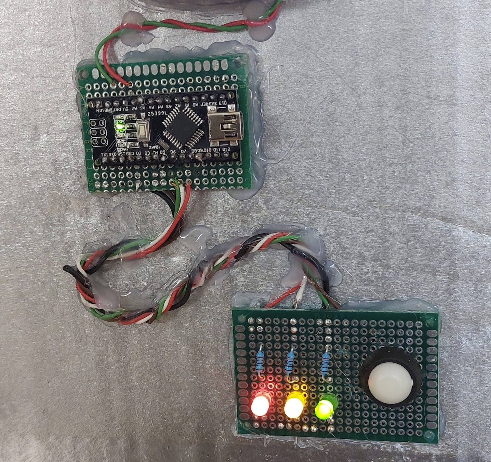
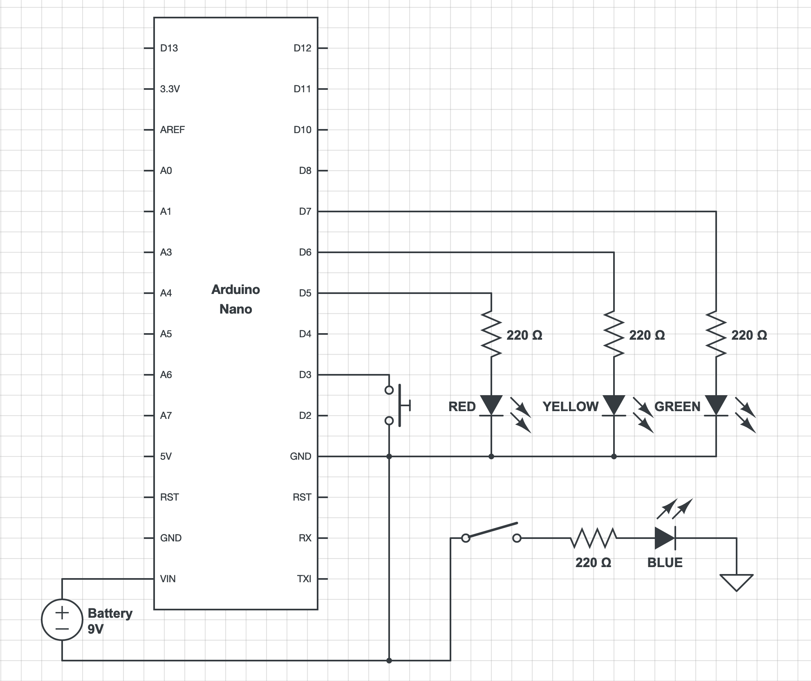
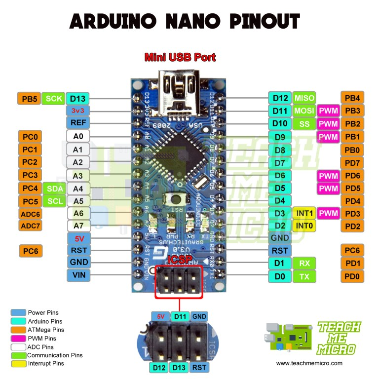

# Blinking Leds

This was part of a robot carnival costume.

## Pictures:

## Design

## Component list

* 1 x Push buttons

* 1 x Yellow Led
* 1 x Green Led
* 1 x Red Led
* 1 x Blue Led
* 1 x Switch
* 1 x 9V battery
* 4 x 220 resistor
* 1 x [WAVGAT Nano V3.0 CH340G](https://es.aliexpress.com/item/32868170637.html?spm=a2g0s.9042311.0.0.274263c05HOWW9)
* 2 x [PCB board](https://es.aliexpress.com/item/32831489775.html?spm=a2g0s.9042311.0.0.274263c05HOWW9)
* Wires
 
## Pinout diagrams
 

 
## Useful links

* [https://bricolabs.cc/wiki/guias/mac_os_y_ch340](https://bricolabs.cc/wiki/guias/mac_os_y_ch340)
* [https://www.circuitlab.com/editor](https://www.circuitlab.com/editor)

  
 	
	
 
