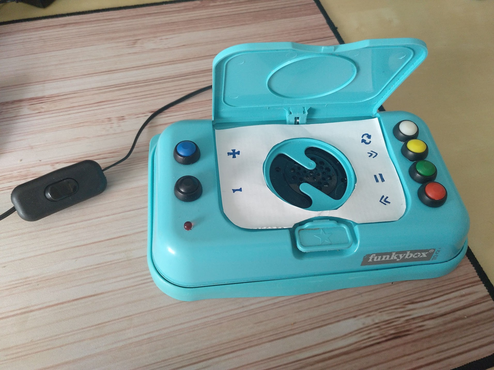
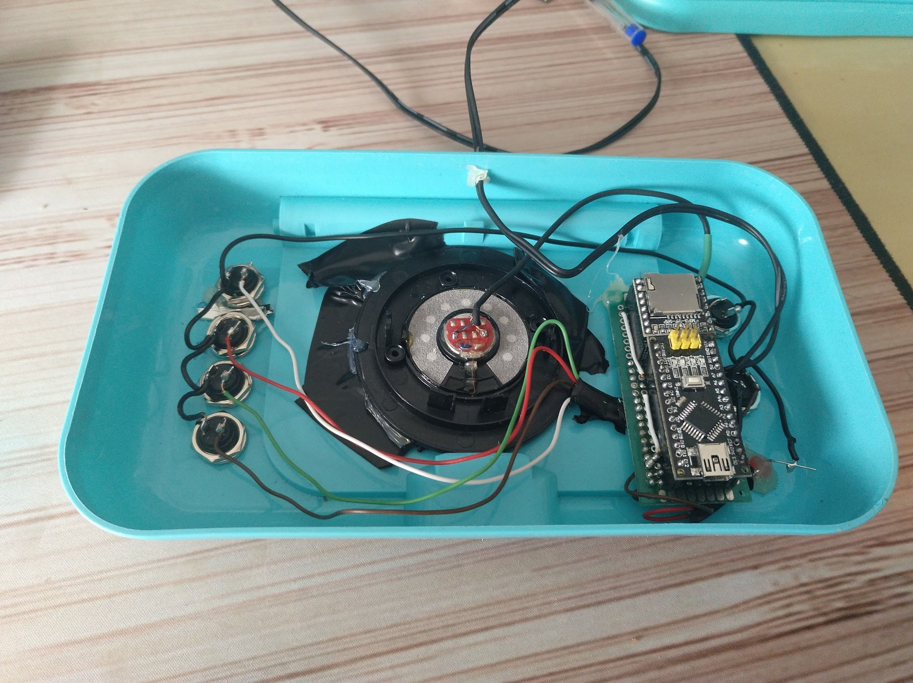
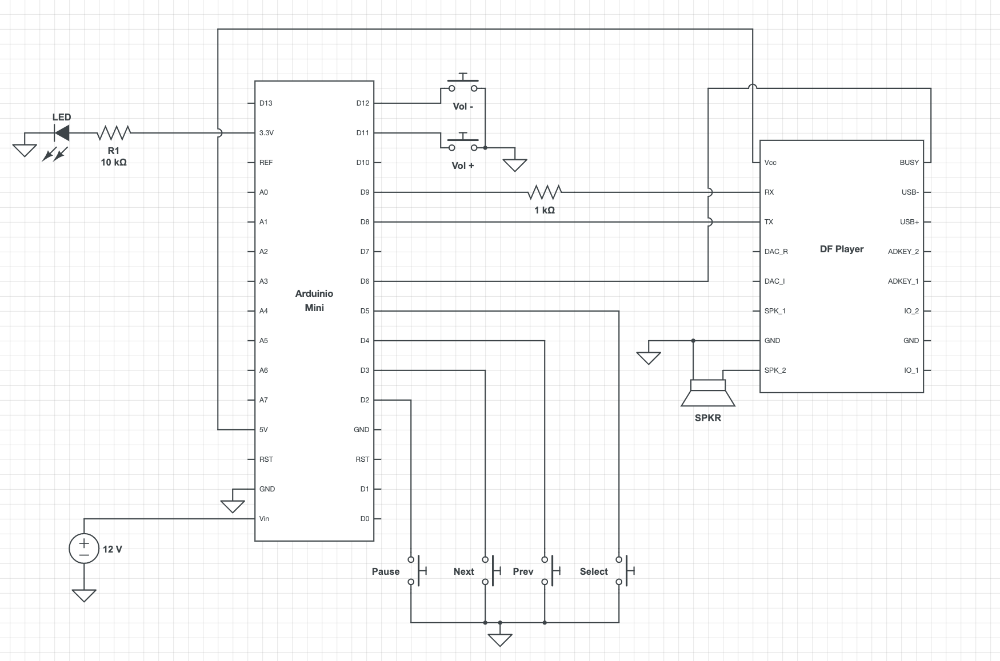
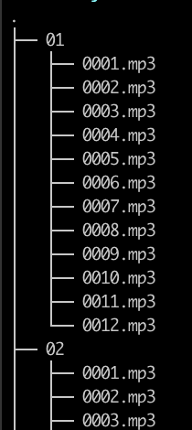
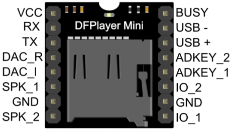

# DIY Lullabies player

-- Work In Progress -- 

## Pictures:

## Design

## Items

* 6 x Push buttons
* 1 x Headphone speaker
* 1 x Led 
* 1 x 1k Ohm resistor
* 1 x 220 resistor
* 2 x 8-pin connector
* 2 x 15-pin connector
* 1 x [DFPlayer MP3](https://es.aliexpress.com/item/32849088916.html?spm=a2g0s.9042311.0.0.69f963c0b0tlxY)
* 1 x [WAVGAT Nano V3.0 CH340G](https://es.aliexpress.com/item/32868170637.html?spm=a2g0s.9042311.0.0.274263c05HOWW9)
* 1 x [PCB board](https://es.aliexpress.com/item/32831489775.html?spm=a2g0s.9042311.0.0.274263c05HOWW9)
* 1 x Micro SD 32Gb
* 1 x Funkybox wet wipe dispenser
* Wires

## Songs
Add your own MP3 files to the MicroSD card with the following structure:

 
## Pinout diagrams
 
 
 
## Useful links
* [http://www.manelsoft.com/projects/arduino_mp3_player.aspx](http://www.manelsoft.com/projects/arduino_mp3_player.aspx)
* [https://wiki.dfrobot.com/DFPlayer_Mini_SKU_DFR0299](https://wiki.dfrobot.com/DFPlayer_Mini_SKU_DFR0299) 
* [http://www.trainelectronics.com/Animation-thunder-lightning/delay.htm](http://www.trainelectronics.com/Animation-thunder-lightning/delay.htm)
* [https://reprage.com/post/dfplayer-mini-cheat-sheet](https://reprage.com/post/dfplayer-mini-cheat-sheet) 
* [https://bricolabs.cc/wiki/guias/mac_os_y_ch340](https://bricolabs.cc/wiki/guias/mac_os_y_ch340)
* [https://www.circuitlab.com/editor](https://www.circuitlab.com/editor)

  
 	
	
 
