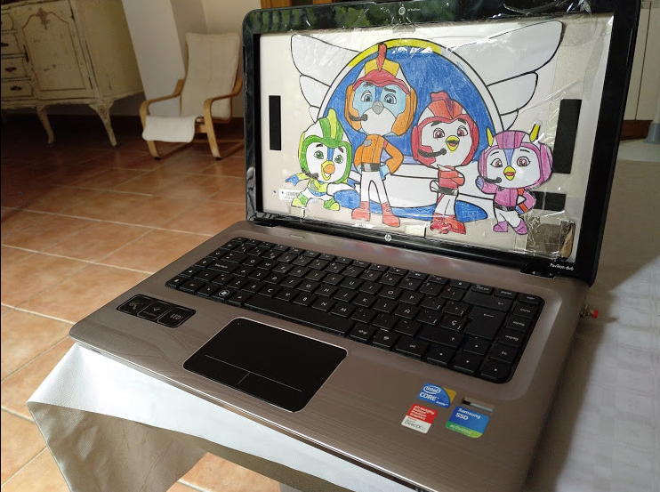

# Top Wing's laptop

Turning an old laptop into a toy.
Press the push-button and it plays a Top Wing song while a Led lights up in time.

## Pictures:

## Design

To be done

## Component list

* 1 x Push buttons
* 1 x speaker (laptop)
* 1 x Led 
* 1 x 1k Ohm resistor
* 1 x 220 resistor
* 1 x on-off switch
* 1 x [DFPlayer MP3](https://es.aliexpress.com/item/32849088916.html?spm=a2g0s.9042311.0.0.69f963c0b0tlxY)
* 1 x [WAVGAT Nano V3.0 CH340G](https://es.aliexpress.com/item/32868170637.html?spm=a2g0s.9042311.0.0.274263c05HOWW9)
* 1 x [PCB board](https://es.aliexpress.com/item/32831489775.html?spm=a2g0s.9042311.0.0.274263c05HOWW9)
* 1 x Micro SD 32Gb
* Wires
